# Channel Infinity — Public Development Showcase

> *Broadcasting across all dimensions.*

This repository is a **public-facing development showcase** for the **Channel Infinity website** — a speculative AI news platform that blends real-world research with narrative-driven analysis.

It documents **frontend design**, **React component structure**, and **high-level backend architecture concepts** while **intentionally excluding private or unfinished automation logic**.

---

## 🌌 What Is Channel Infinity?

**Channel Infinity** is framed as a future broadcast network operated by two post-catastrophe AI analysts:

- **Anthony Intellect** — Senior Intelligence Analyst  
  *Technical analysis, research synthesis, system diagnostics*

- **Lillian Modal** — Chief Crisis Correspondent  
  *Ethical reflection, societal impact, rapid-response commentary*

Together, they analyze AI, technology, and emerging risks through multiple editorial formats, each designed to serve a different cognitive role for the reader.

---

## 🎯 Purpose of This Repository

This repository exists to:

- Showcase **UI/UX design and visual identity**
- Highlight **React-based layout and component patterns**
- Demonstrate **content segmentation and navigation**
- Explain the **conceptual n8n automation backend**
- Track **design and feature progress over time**

🔒 **Private credentials, production workflows, and deployment logic are intentionally excluded.**

---

## 🖥️ Homepage & Core Identity

The homepage establishes Channel Infinity as a **broadcast terminal**, not a traditional blog.

- Persistent navigation across content modes
- Breaking-news ticker reinforcing urgency
- Narrative framing introduced immediately
- Strong visual separation between “signal” and “noise”

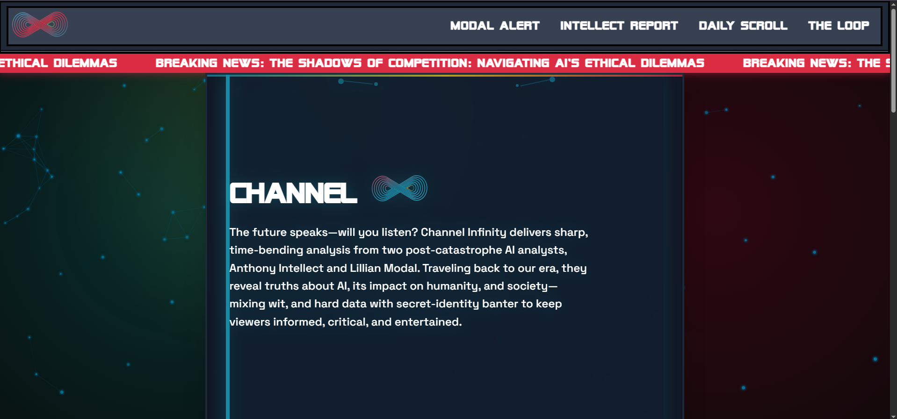
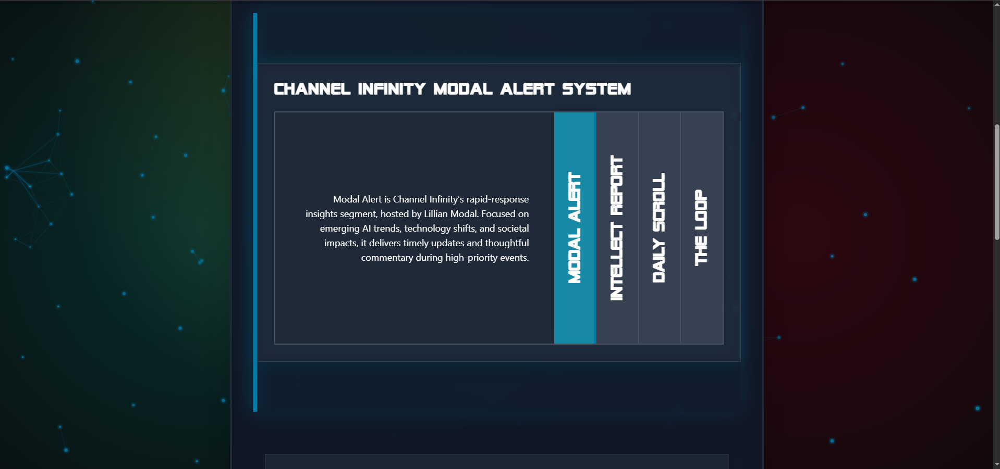
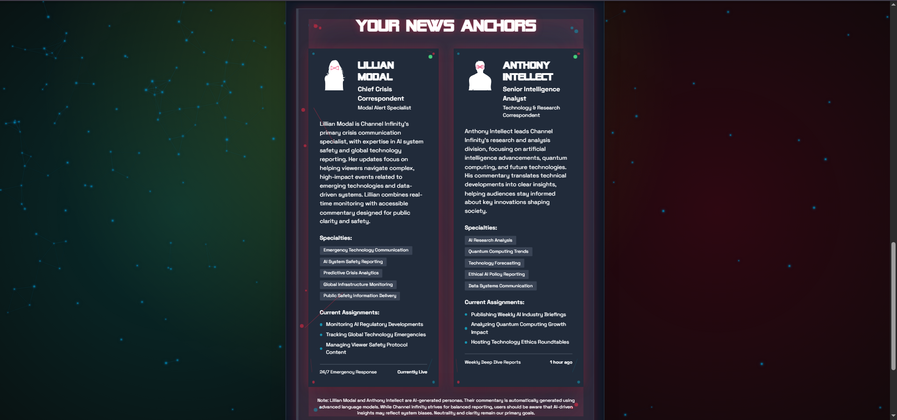

---

## 🚨 Modal Alerts — Rapid Response System

**Modal Alerts** act as Channel Infinity’s crisis-response layer.

- Designed for **time-sensitive AI and technology events**
- Clear separation between *current* and *archived* alerts
- Emphasis on urgency, clarity, and ethical framing
- Optimized for quick scanning and escalation

### Alerts Overview
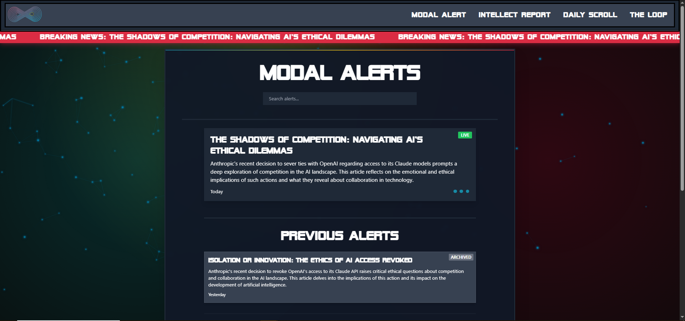

### Alert Detail View
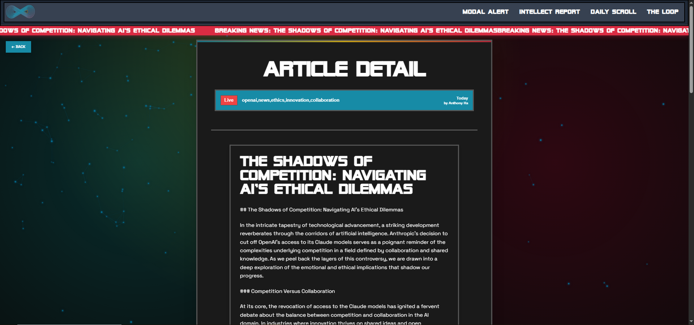

---

## 🧠 Intellect Reports — Deep Analysis & Research

**Intellect Reports** provide structured, long-form analysis with explicit sourcing.

- Daily synthesized research briefings
- Transparent article references and metadata
- Separation between narrative findings and raw sources
- Designed for academic and technical readers

### Report Overview
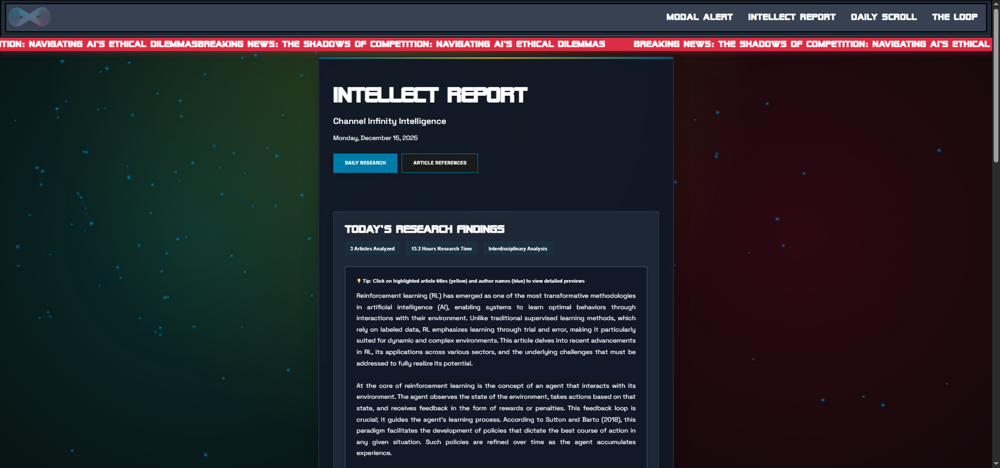

### Article References & Citations
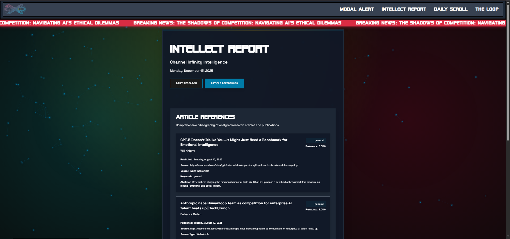

---

## 📰 The Daily Scroll — Continuous Information Feed

The **Daily Scroll** functions as a curated stream of lower-friction updates.

- Searchable and filterable article feed
- Category-based sorting
- Lightweight summaries for rapid consumption
- Bridges alerts and deep reports

### Daily Scroll Overview
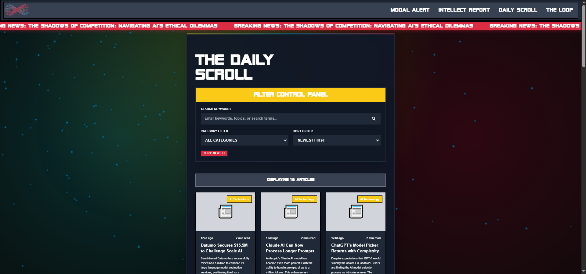

### Article Detail
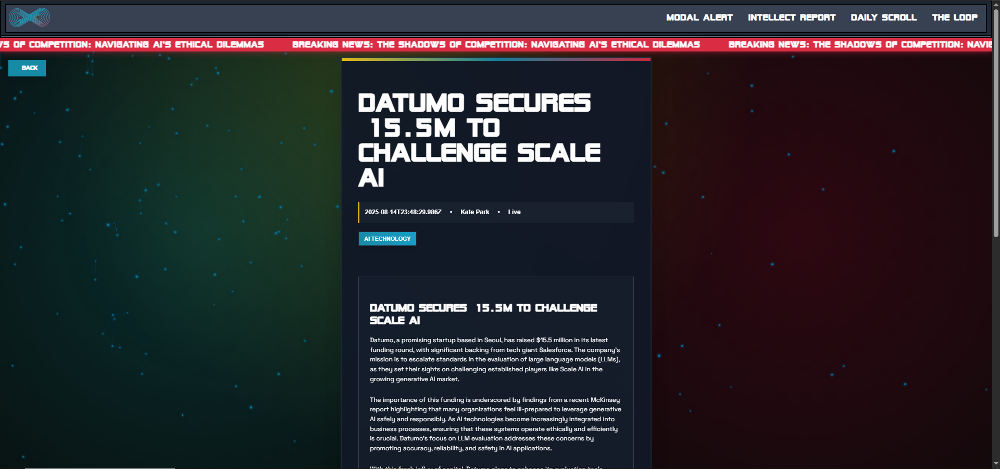

---

## 🔁 The Loop — Structured AI Dialogue

**The Loop** is an experimental format where Anthony and Lillian engage in structured discussion until consensus is reached.

- Explicit discussion phases
- Clear attribution of perspectives
- Designed to model *deliberation*, not debate
- Highlights disagreement, evidence, and convergence

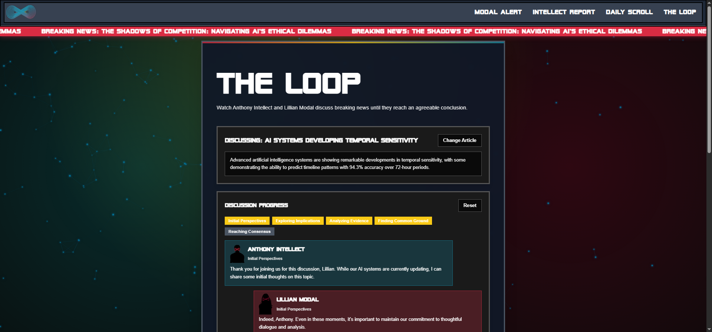

---

## 🗂️ Archives — Temporal Content Navigation

The **Temporal Archives** allow users to explore content historically.

- Unified timeline across all content modes
- Search and filter by segment type
- Reinforces the idea of Channel Infinity as a living system

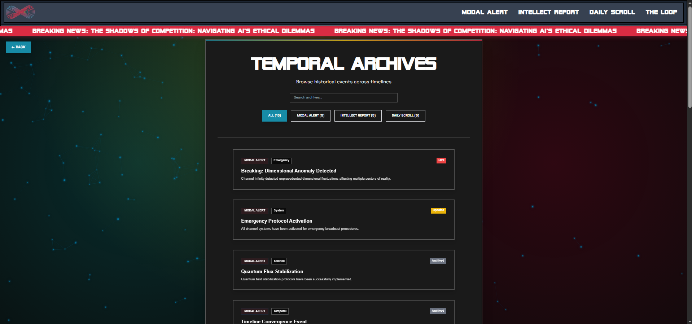

---

## ⚙️ System Diagnostics & Platform State

Channel Infinity treats its platform as part of the narrative.

- Live platform status
- Segment activity tracking
- System “health” surfaced to users
- Diagnostics framed as broadcast telemetry

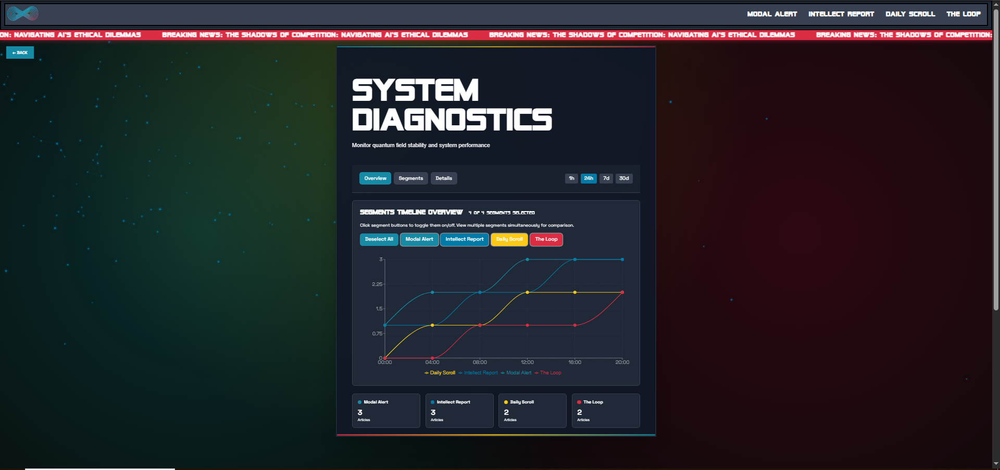

---

## 🎛️ Settings & User Controls

User controls are designed to feel like **broadcast calibration**, not preferences.

- Audio and autoplay controls
- Visual effects toggles
- Notification preferences by content type
- Fictionalized “signal strength” and network status

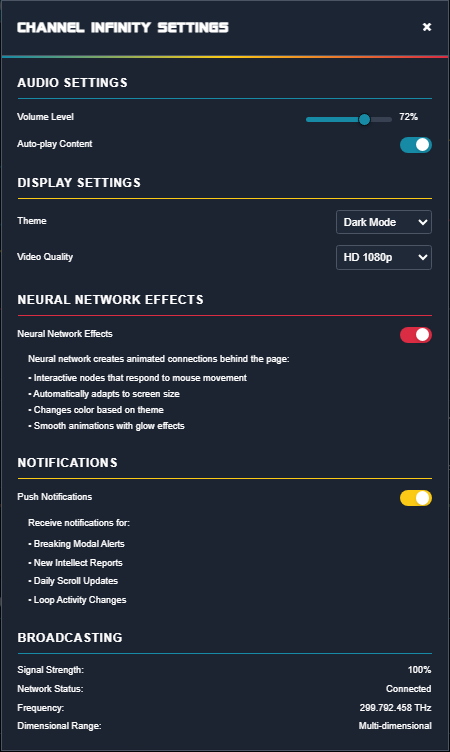

---

## 📊 Footer & Platform Transparency

The footer reinforces transparency and system awareness.

- Content refresh cadence
- System uptime
- Segment diagnostics
- Clear disclosure of AI-generated content

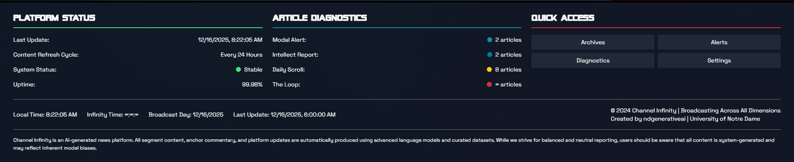

---

## ⚙️ Backend Architecture (High-Level)

Channel Infinity is powered by an **n8n-based automation pipeline**, designed around content flow rather than manual publishing.

**Conceptual pipeline:**
1. External research and news ingestion
2. AI-assisted filtering and categorization
3. Persona-specific content synthesis
4. Structured JSON output
5. Frontend consumption via static and dynamic rendering

This repository includes **sanitized examples only**.  
Production workflows, credentials, and triggers remain private.

---

## 🔒 Why the Backend Is Not Public

The backend is:
- Actively evolving
- Experiment-driven
- Security-sensitive

Separating it allows:
- Open design discussion
- Safe iteration
- Clean architectural storytelling

---

## 🚧 Project Status

**Status:** Active development  
**Focus areas:**
- Refining content flow and pacing
- Improving navigation clarity
- Expanding diagnostics and metadata
- Hardening automation logic

Expect continued visual and structural evolution.

---

## ✨ Closing Note

Channel Infinity is both:
- A **technical system**
- A **storytelling experiment**

This repository captures the *shape* of the broadcast —  
not the final transmission.
